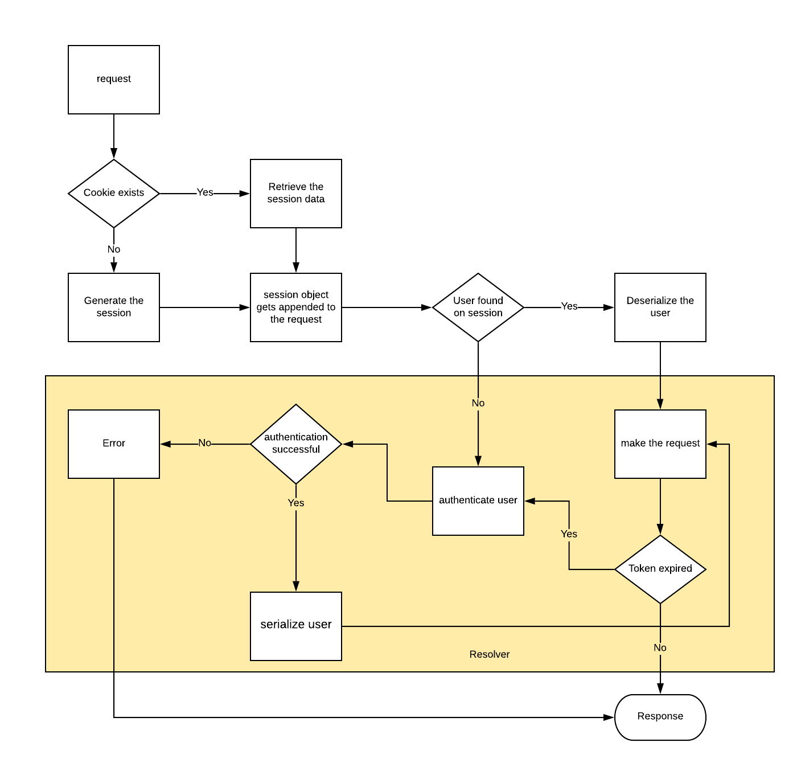

# Session Management

When Sample App is loaded by the client it is initialized with the express authentication middleware, [passportjs](http://www.passportjs.org/). Once passport is initialized `passport.session` is invoked generating the session. Using [express-session](https://www.npmjs.com/package/express-session) a cookie is generated that that represents the session. The strategy Sample App is utilizing to authenticate is `GraphQLLocalStrategy` from the [graphql-passport](https://www.npmjs.com/package/graphql-passport) package. Authenticating the user allows for certain action to take place, for example creating a basket. After successful authentication the anonymous user ID is stored in the session that corresponds to the cookie that is generated by express-session.

### Session Management and Authentication Flow




express-session is utilized to generate a unique cookie that represents the session. connect.sid is the default session ID cookie from express-session. When this cookie expires a new cookie will automatically be created

Passport is utilized for authentication and provides functions to easily serialize and deserialize a user to and from the session. As stated in the [architecture document](architecture.md) the front-end client communicates with the BFF via GraphQL. In Sample App every query using GraphQL goes through the `/api` route. GraphQL separates queries based on resolvers in Sample App. An authentication request is needed to get an access token that allows the app to perform certain actions including but not limited to creating a basket or add products to a basket. To do this authentication Sample App uses the package graphql-passport to provide the functionality to authenticate with passport.


GraphQL provides a `context` object which is the third parameter on any resolver. It is a place to put data that is available by the resolvers and is generated per request. Sample App populates this context object in [graphql.ts](../packages/@sfcc-core/core-graphql/src/graphql.ts) inside the `core-graphql` package. The `context` function defined in graphql.ts takes two parameters, request and response.
```typescript
this.apolloServer = new ApolloServer({
    schema,
    context: ({ req, res }) => ({
        ...graphqlPassport.buildContext({ req, res }),
        setSessionProperty(key: string, value: string) {
            (req as Request).session[key] = value;
        },
        getSessionProperty(key: string) {
            return (req as Request).session[key];
        },
    }),
});
```

The request parameter is the same request object that express generates and is the actual web service call that contains the request headers, cookies and etc. In the context function the helper function `buildContext()` provided by graphql-passport helps build a context that is unique for each user and adds methods to the context to help authenticate with passport. With the context object built, a resolver can now easily ensure that the user is authenticated.

The resolvers in Sample App need to retrieve the user from the context. To help with this operation Sample App defines a function `getUserFromContext()` This function calls the `context.authenticate()` function provided by  graphql-passport. 

```typescript
export async function getUserFromContext(context: AppContext) {
    let user = context.getUser();
    const token = user ? user.token : '';
    if (!token) {
        const res = await context.authenticate('graphql-local', { token });
        context.login(res.user);
        user = res.user;
    }
    return user;
}
```

`context.authenticate` calls the graphql-passport strategy configured in [runtime.js](../packages/storefront-lwc/scripts/runtime.js). This is the central location to perform the authentication logic.

```typescript
passport.use(
    new graphqlPassport.GraphQLLocalStrategy(function(user, pass, done) {
        const clientConfig = getCommerceClientConfig(config);
        CommerceSdk.helpers
            .getShopperToken(clientConfig, { type: 'guest' })
            .then(token => {
                const customerId = JSON.parse(token.decodedToken.sub)
                    .customer_info.customer_id;
                done(null, {
                    id: customerId,
                    token: token.getBearerHeader(),
                });
            })
            .catch(error => done(error));
    }),
);
```

In Sample App’s authentication configuration the shopper token is retrieved from the Commerce SDK. From this token the anonymous user customer ID is determined. If authentication is successful a user is returned containing the id and the bearer token. Following successful authentication the `getUserFromContext()` calls `context.login()` the login call invokes `passport.serializeUser`

```typescript
passport.serializeUser(function(user, done) {
    users.set(user.id, user);
    done(null, user.id);
});
```

The above function is used to serialize the user to the in memory users object for the session.
